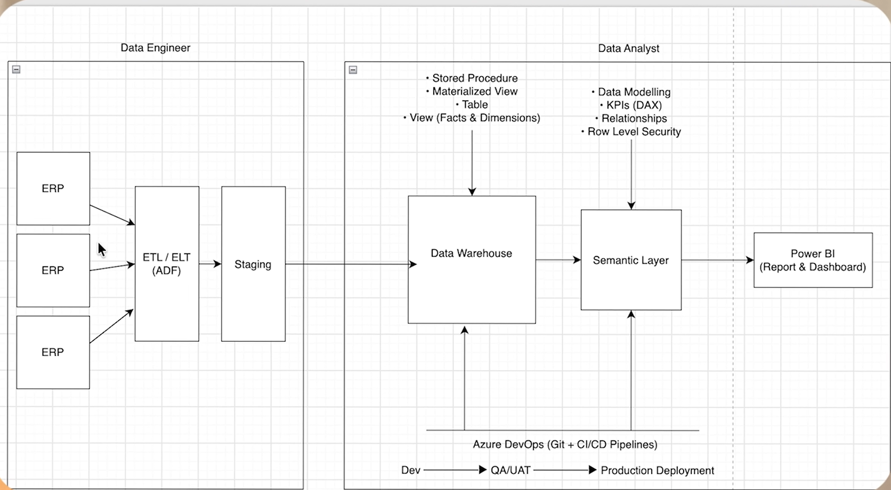

# Modern Data & Analytics Architecture

This repository documents my learning and understanding of **modern, real-world data architectures** used in enterprise environments.

The goal is to understand how data moves from operational systems to analytics and business intelligence platforms, and to share these concepts with other students, developers, data analysts, and aspiring data engineers.

> **Note:** This is a reference architecture for learning purposes. Different organizations use different technologies and may have additional or fewer layers.

## Architecture Overview



### High-Level Data Flow

**ERP / Source Systems → ETL/ELT → Staging → Data Warehouse → Semantic Layer → Power BI**

## 1. Source Systems / ERP

Operational systems generate the original business data.

Examples include:

* Sales
* Customers
* Products
* Inventory
* Finance
* Orders
* Suppliers

These systems are optimized for running business operations rather than analytics.

## 2. ETL / ELT — Azure Data Factory

Azure Data Factory can be used to build and orchestrate data pipelines.

Typical responsibilities include:

* Extracting data from source systems
* Moving data between systems
* Scheduling pipelines
* Transforming data
* Loading data into staging or analytical storage
* Monitoring pipeline execution

### ETL

**Extract → Transform → Load**

### ELT

**Extract → Load → Transform**

Modern cloud architectures commonly use both approaches depending on the platform and workload.

## 3. Staging Layer

The staging layer acts as an intermediate area between source systems and the data warehouse.

It can be used for:

* Initial data ingestion
* Data validation
* Deduplication
* Data type checking
* Transformation preparation
* Handling incremental loads
* Temporary storage of incoming data

Example:

```text
ERP
 ↓
ADF Pipeline
 ↓
Staging
 ↓
Data Warehouse
```

## 4. Data Warehouse

The data warehouse stores structured, historical data designed for analytics and reporting.

A common modelling approach is a **Star Schema** containing:

* Fact tables
* Dimension tables

Example:

```text
              Dim_Customer
                    │
                    │
Dim_Product ─── Fact_Sales ─── Dim_Date
                    │
                    │
              Dim_Store
```

A fact table generally contains measurable business events, while dimension tables provide descriptive information about those events.

## 5. Semantic Layer

The semantic layer provides a business-friendly representation of the underlying data.

It can contain:

* Relationships
* Business metrics
* KPIs
* Measures
* Calculated columns
* Security rules
* Business definitions

In a Microsoft Power BI environment, this layer is commonly represented by a **Power BI semantic model**.

## 6. Power BI

Power BI consumes the prepared analytical data and semantic model to provide:

* Reports
* Dashboards
* KPIs
* Data exploration
* Business insights

The final users may include:

* Data Analysts
* Business Analysts
* Managers
* Executives
* Business teams

## 7. Azure DevOps & CI/CD

Azure DevOps can support development and deployment workflows.

A simplified flow can be:

```text
Development
     ↓
QA / UAT
     ↓
Production
```

Git repositories and CI/CD pipelines help teams manage:

* Version control
* Code changes
* Data pipeline deployments
* Testing
* Environment management
* Production releases

## Data Engineer vs Data Analyst

### Data Engineer

Typically focuses on:

* Data ingestion
* ETL/ELT pipelines
* Data storage
* Data transformation
* Data quality
* Data warehouse development
* Data modelling
* Pipeline orchestration
* Performance and reliability

### Data Analyst / BI Professional

Typically focuses on:

* SQL analysis
* Data exploration
* KPI development
* DAX
* Semantic models
* Power BI
* Dashboards
* Reporting
* Business insights

There can be significant overlap between these roles, and many organizations also have separate **Analytics Engineer** or **BI Developer** roles.

## Important Principle

The technologies may change between companies.

For example:

```text
Azure Data Factory → Airflow → Fivetran
Data Warehouse    → Snowflake → BigQuery → Synapse
Power BI          → Tableau → Looker
```

But the fundamental idea often remains:

**Source → Ingest → Store → Transform → Model → Analyze → Visualize**

This repository is intended as a learning resource to understand these concepts and how they fit together in real-world data platforms.
